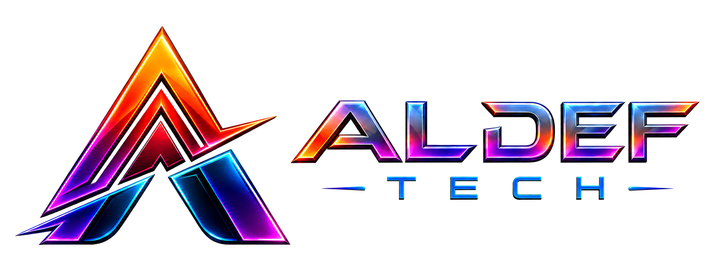

<p align="center">
  <a href="https://aldeftech.com" target="_blank">
    
  </a>
</p>

<p align="center">
  <strong>Bangun Sistem Digital yang Menggerakkan Bisnis.</strong>
</p>

<p align="center">
  <a href="https://aldeftech.com"></a>
  
  
  
</p>

## Tentang Aldef Tech

**Aldef Tech** adalah mitra transformasi digital yang membantu bisnis merancang, membangun, dan mengembangkan teknologi sesuai kebutuhan operasionalnya. Kami menggabungkan pemahaman proses bisnis dengan software engineering untuk menghasilkan solusi yang efektif, scalable, aman, dan mudah dikembangkan dalam jangka panjang.

Mulai dari validasi kebutuhan hingga deployment dan dukungan pascapeluncuran, setiap solusi dirancang untuk menyederhanakan pekerjaan, menghubungkan data, mengurangi proses manual, dan membantu perusahaan mengambil keputusan dengan lebih cepat.

### Fokus layanan

- **Custom Software Engineering** — sistem bisnis yang mengikuti alur kerja dan kebutuhan unik perusahaan.
- **Web Application & SaaS Development** — aplikasi web modern dan platform multi-tenant yang siap berkembang.
- **AI Solutions & Intelligent Automation** — integrasi AI, knowledge base, AI agent, dan otomasi proses bisnis.
- **Business Process Automation** — digitalisasi workflow, approval, pelaporan, dan pekerjaan berulang.
- **System Integration & Enterprise API** — integrasi ERP, payment gateway, WhatsApp, sistem legacy, dan layanan pihak ketiga.
- **Modernization & Performance Tuning** — refactoring aplikasi lama, peningkatan performa, keamanan, dan kesiapan skala.

## Tentang Repositori

Repositori ini berisi source code website resmi [aldeftech.com](https://aldeftech.com) sekaligus platform pengelolaan kontennya. Aplikasi dibangun dengan Laravel dan menyediakan pengalaman bilingual dalam Bahasa Indonesia dan Inggris.

Fitur utamanya meliputi:

- halaman layanan, solusi, portofolio, profil perusahaan, FAQ, dan insight;
- CMS untuk mengelola konten homepage, layanan, portofolio, blog, dan testimonial;
- manajemen lead dari formulir konsultasi, termasuk status, catatan, penugasan, dan ekspor;
- pengaturan SEO per halaman dan bahasa, sitemap, serta integrasi analytics;
- role-based access untuk super admin, editor, dan sales manager;
- pusat pemasaran berbantuan AI untuk menyusun ide dan konten kampanye;
- integrasi WhatsApp dan pengaturan identitas perusahaan.

## Teknologi

| Area | Teknologi |
| --- | --- |
| Backend | PHP 8.3+, Laravel 13 |
| Frontend | Blade, Tailwind CSS 4, Alpine.js, Bootstrap 5 |
| Database | MySQL |
| Asset bundler | Vite 8 |
| Testing | PHPUnit 12 |

## Menjalankan Secara Lokal

### Prasyarat

- PHP 8.3 atau lebih baru
- Composer
- Node.js dan npm
- MySQL

### Instalasi

```bash
git clone https://github.com/aldef-deni/aldeftech.com.git
cd aldeftech.com
composer install
npm install
cp .env.example .env
php artisan key:generate
```

Sesuaikan koneksi database dan konfigurasi lain di `.env`, lalu jalankan:

```bash
php artisan migrate --seed
npm run build
php artisan serve
```

Untuk mode pengembangan dengan server Laravel, queue worker, log viewer, dan Vite yang berjalan bersamaan:

```bash
composer run dev
```

Aplikasi dapat diakses melalui `http://localhost:8000`, sedangkan panel pengelola tersedia di `http://localhost:8000/admin`.

## Pengujian

```bash
composer test
```

## Kontak

Punya kebutuhan sistem, aplikasi, SaaS, integrasi, atau otomasi AI? Kunjungi [aldeftech.com/contact](https://aldeftech.com/contact) untuk mendiskusikan kebutuhan bisnis Anda bersama Aldef Tech.

---

<p align="center">
  © Aldef Tech. Seluruh hak cipta dilindungi.
</p>
